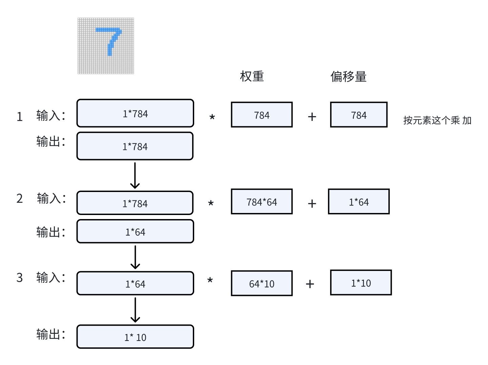
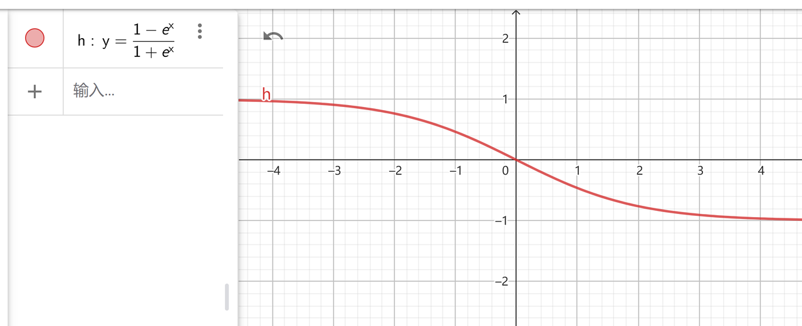
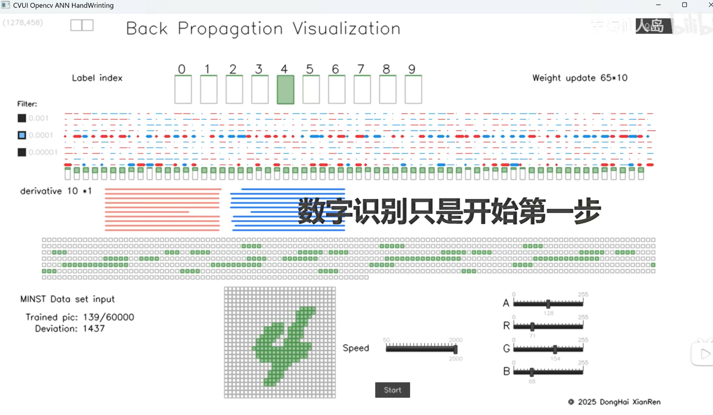

# 手写输入可视化工具
### 版权所有 东海仙人岛 2025年3月 
* B站：https://space.bilibili.com/627167269
* EMAL: doorwin2008@163.com
## 缘起：
基于MINST数据集训练的权重，几行代码就可以实现预测结果的输出，我想做一个简单的机器学习的神经网络可视化程序，这是第一版，效果已经不错了。
有一个问题就是隐藏层的数据看不到，我想根据计算权重的结果，把中间层的神经元和输入输出连接起来，应该怎么办呢，搜遍全网也找不到现成的代码，算了，还是手搓一个吧。既然例子都是基于OpenCV的，就研究一下OpenCV的底层代码，解开她神秘的面纱。
## 功能需求：
* 手写数组输入功能，可视化展示机器学习神经网络的结果，模拟神经元链接，动态展示识别过程的变化
## 设计方案：
* 界面显示，采用cvui; 权重文件的读取，采用opencv ML ANN
* 本程序只依赖Opencv的库 版本  4.10.0
* 网络结构，输入层 28*28，隐藏层 64 ，输出层 10
* * 
* 激活函数 y=(1. - x) / (1. + x)
* 
## 使用说明：
* 权重文件，采用MINST训练的数据集
* 左键书写，右键擦除，esc按键退出.左侧的复选框可以显示或隐藏神经元连线。\
* 使用说明：数组支持0-9，根据训练库的特点，数字尽量写的大一些，尽量占据网格的中间，不要写在边角。

* 推理过程，展现手写面板，隐藏层，输出层，神经元和链接

* 训练过程，展现数据集导入数据，正向传播，反向传播，参数不断修改的过程

