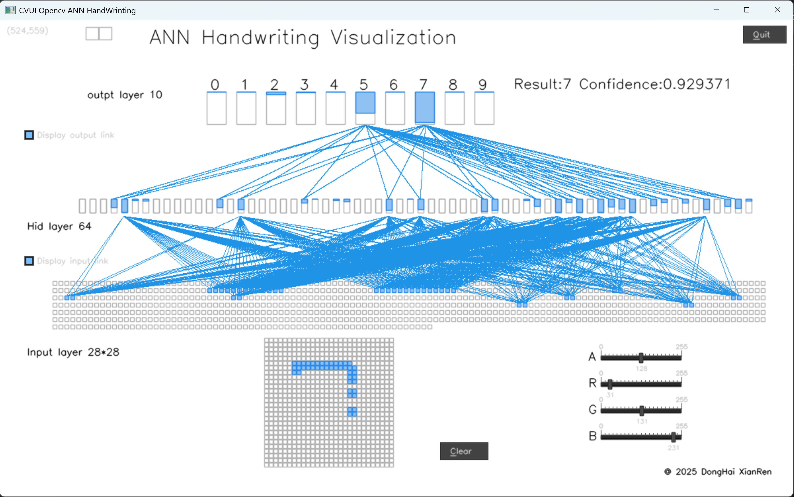

# 手写输入可视化工具
### 版权所有 东海仙人岛 2025年3月 
* B站：https://space.bilibili.com/627167269
* EMAL: doorwin2008@163.com
## 功能需求：
* 手写数组输入功能，可视化展示机器学习神经网络的结果，模拟神经元链接，动态展示识别过程的变化
## 设计方案：
* 界面显示，采用cvui; 权重文件的读取，采用opencv 4.10.0
* 网络结构，输入层 28*28，隐藏层 64 ，输出层 10
* 激活函数 y=(1. - x) / (1. + x)
## 使用说明：
* 权重文件，采用MINST训练的数据集
* 左键书写，右键擦除，esc按键退出.左侧的复选框可以显示或隐藏神经元连线。\
* 使用说明：数组支持0-9，根据训练库的特点，数字尽量写的大一些，尽量占据网格的中间，不要写在边角。

* 

